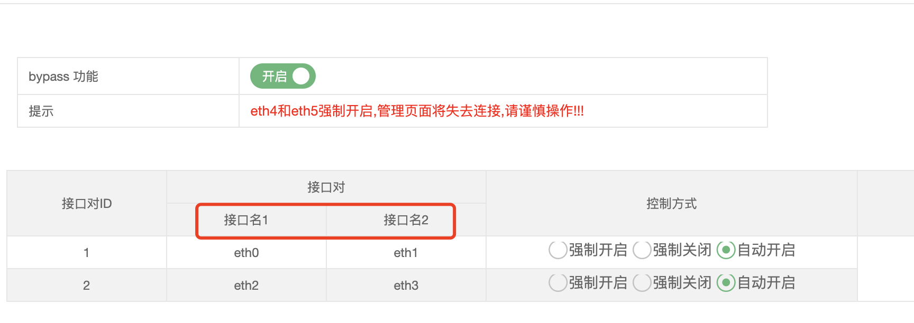
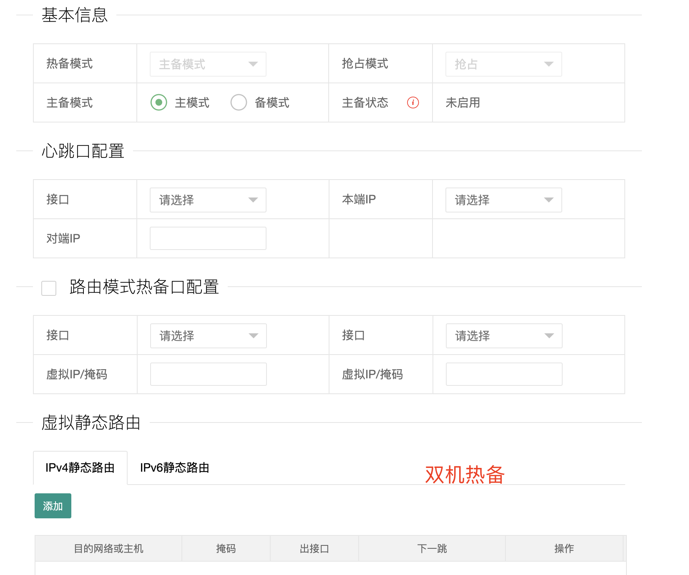
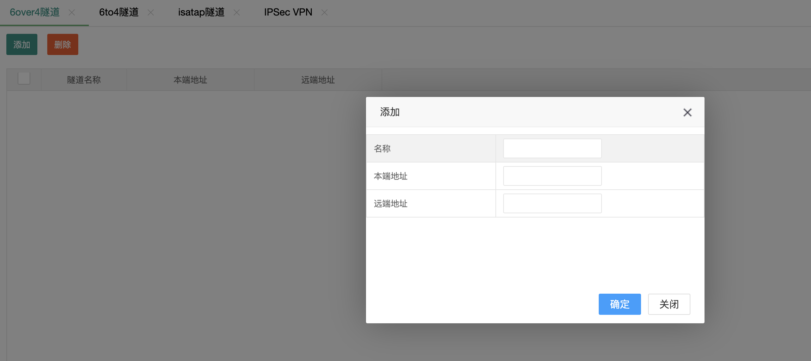
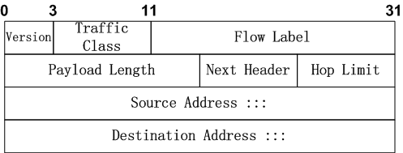
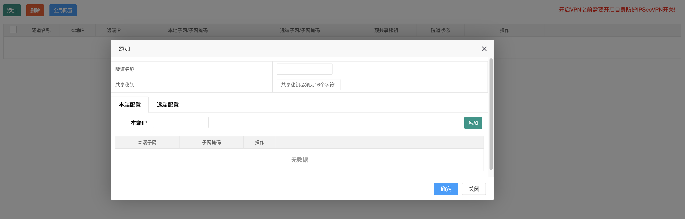
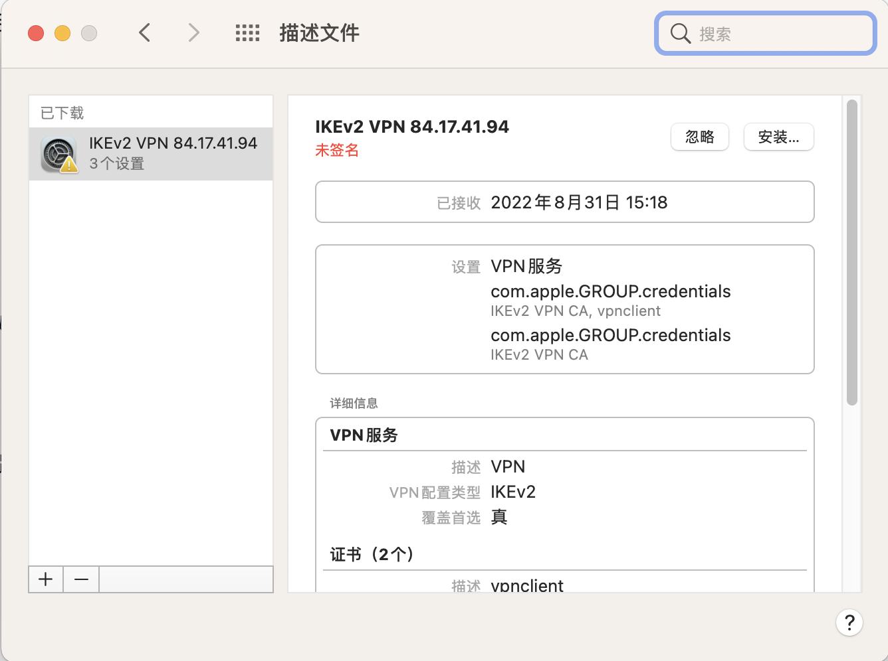
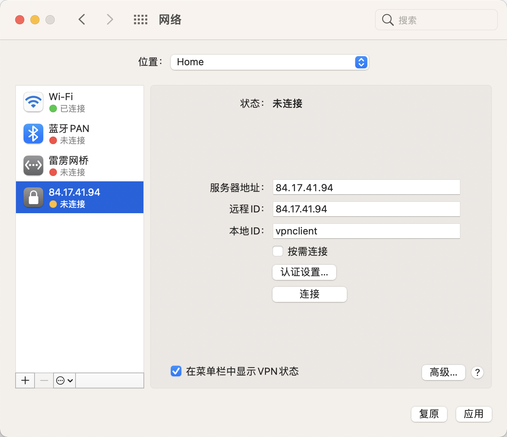
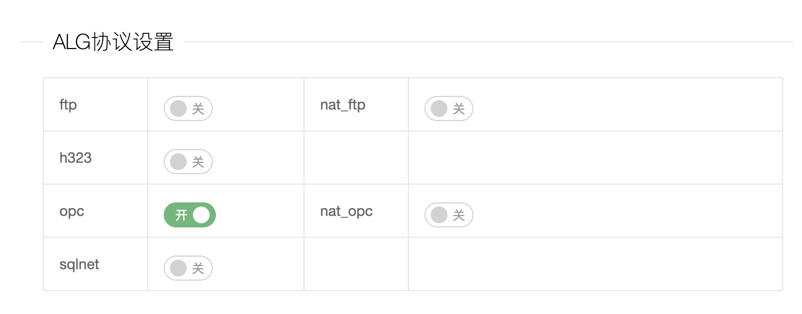

- # 防火墙  
[防火墙国标37933](https://www.wangan.com/docs/gbt37933-2019)  
## iptables

Simply put, iptables is a firewall program for Linux. It will monitor traffic from and to your server using `tables`. These tables contain sets of `rules`, called `chains`, that will filter `incoming` and `outgoing` data packets.

When a packet matches a rule, it is given a `target`, which can be another chain or one of these special values:

- ACCEPT – will allow the packet to pass through.
- DROP – will not let the packet pass through.
- RETURN – stops the packet from traversing through a chain and tell it to go back to the previous chain.  


In this iptables tutorial, we are going to work with one of the default tables, called `filter`. It consists of three chains:

- INPUT –  controls incoming packets to the server.
- FORWARD – filters incoming packets that will be forwarded somewhere else.
- OUTPUT – filter packets that are going out from your server.
  

安装
```shell
sudo apt-get update
sudo apt-get install iptables
```

查看状态
```shell
$ sudo iptables -L -v
Chain INPUT (policy ACCEPT 0 packets, 0 bytes)
 pkts bytes target     prot opt in     out     source               destination         

Chain FORWARD (policy ACCEPT 0 packets, 0 bytes)
 pkts bytes target     prot opt in     out     source               destination         

Chain OUTPUT (policy ACCEPT 0 packets, 0 bytes)
 pkts bytes target     prot opt in     out     source               destination  
```

定义规则
Defining a rule means appending it to the chain. To do this, you need to insert the -A option (Append) right after the iptables command, like so:  
```shell
sudo iptables -A
```

It will alert iptables that you are adding new rules to a chain. Then, you can combine the command with other options, such as:  

- `-i` (interface) — the network interface whose traffic you want to filter, such as eth0, lo, ppp0, etc.
- `-p` (protocol) — the network protocol where your filtering process takes place. It can be either tcp, udp, udplite, icmp, sctp, icmpv6, and so on. Alternatively, you can type all to choose every protocol.
- `-s` (source) — the address from which traffic comes from. You can add a hostname or IP address.
- –`dport` (destination port) — the destination port number of a protocol, such as 22 (SSH), 443 (https), etc.
- `-j` (target) — the target name (ACCEPT, DROP, RETURN). You need to insert this every time you make a new rule.  

```shell
sudo iptables -A <chain> -i <interface> -p <protocol (tcp/udp) > -s <source> --dport <port no.>  -j <target>
```


帮助信息
```shell
iptables v1.4.21

Usage: iptables -[ACD] chain rule-specification [options]
       iptables -I chain [rulenum] rule-specification [options]
       iptables -R chain rulenum rule-specification [options]
       iptables -D chain rulenum [options]
       iptables -[LS] [chain [rulenum]] [options]
       iptables -[FZ] [chain] [options]
       iptables -[NX] chain
       iptables -E old-chain-name new-chain-name
       iptables -P chain target [options]
       iptables -h (print this help information)

Commands:
Either long or short options are allowed.
  --append  -A chain		Append to chain
  --check   -C chain		Check for the existence of a rule
  --delete  -D chain		Delete matching rule from chain
  --delete  -D chain rulenum
				Delete rule rulenum (1 = first) from chain
  --insert  -I chain [rulenum]
				Insert in chain as rulenum (default 1=first)
  --replace -R chain rulenum
				Replace rule rulenum (1 = first) in chain
  --list    -L [chain [rulenum]]
				List the rules in a chain or all chains
  --list-rules -S [chain [rulenum]]
				Print the rules in a chain or all chains
  --flush   -F [chain]		Delete all rules in  chain or all chains
  --zero    -Z [chain [rulenum]]
				Zero counters in chain or all chains
  --new     -N chain		Create a new user-defined chain
  --delete-chain
            -X [chain]		Delete a user-defined chain
  --policy  -P chain target
				Change policy on chain to target
  --rename-chain
            -E old-chain new-chain
				Change chain name, (moving any references)
Options:
    --ipv4	-4		Nothing (line is ignored by ip6tables-restore)
    --ipv6	-6		Error (line is ignored by iptables-restore)
[!] --protocol	-p proto	protocol: by number or name, eg. `tcp'
[!] --source	-s address[/mask][...]
				source specification
[!] --destination -d address[/mask][...]
				destination specification
[!] --in-interface -i input name[+]
				network interface name ([+] for wildcard)
 --jump	-j target
				target for rule (may load target extension)
  --goto      -g chain
                              jump to chain with no return
  --match	-m match
				extended match (may load extension)
  --numeric	-n		numeric output of addresses and ports
[!] --out-interface -o output name[+]
				network interface name ([+] for wildcard)
  --table	-t table	table to manipulate (default: `filter')
  --verbose	-v		verbose mode
  --wait	-w		wait for the xtables lock
  --line-numbers		print line numbers when listing
  --exact	-x		expand numbers (display exact values)
[!] --fragment	-f		match second or further fragments only
  --modprobe=<command>		try to insert modules using this command
  --set-counters PKTS BYTES	set the counter during insert/append
[!] --version	-V		print package version.
```


### HTTP,SSH,SSL  

```shell
sudo iptables -A INPUT -p tcp --dport 22 -j ACCEPT 
sudo iptables -A INPUT -p tcp --dport 80 -j ACCEPT 
sudo iptables -A INPUT -p tcp --dport 443 -j ACCEPT
```

查看规则
```shell
# sudo iptables -L -v
Chain INPUT (policy ACCEPT 1 packets, 76 bytes)
 pkts bytes target     prot opt in     out     source               destination         
    0     0 ACCEPT     all  --  lo     any     anywhere             anywhere            
   10   652 ACCEPT     tcp  --  any    any     anywhere             anywhere             tcp dpt:ssh
    0     0 ACCEPT     tcp  --  any    any     anywhere             anywhere             tcp dpt:http
    0     0 ACCEPT     tcp  --  any    any     anywhere             anywhere             tcp dpt:https

Chain FORWARD (policy ACCEPT 0 packets, 0 bytes)
 pkts bytes target     prot opt in     out     source               destination         

Chain OUTPUT (policy ACCEPT 4 packets, 396 bytes)
 pkts bytes target     prot opt in     out     source               destination 
```

### 根据来源过滤数据包

iptables 允许您根据 IP 地址或 IP 地址范围过滤数据包。您需要在`-s`选项之后指定它。例如，要接受来自192.168.1.3的数据包，命令将是：

```shell
sudo iptables -A INPUT -s 192.168.1.3 -j ACCEPT
```

您还可以通过将ACCEPT目标替换为DROP来拒绝来自特定 IP 地址的数据包。
```shell
sudo iptables -A INPUT -s 192.168.1.3 -j DROP
```

如果你想从一系列 IP 地址中丢弃数据包，你必须使用-m选项和iprange模块。然后，使用–src-range指定 IP 地址范围。请记住，连字符应分隔 ip 地址范围而没有空格，如下所示：  
```shell
sudo iptables -A INPUT -m iprange --src-range 192.168.1.100-192.168.1.200 -j DROP
```


### 丢弃所有其他流量
在定义–dport规则后，对所有其他流量使用DROP目标至关重要。这将防止未经授权的连接通过其他开放端口访问服务器。为此，只需键入：  

```shell
sudo iptables -A INPUT -j DROP
```

现在，指定端口外的连接将被丢弃。  

查看配置
```shell
# sudo iptables -L -v
Chain INPUT (policy ACCEPT 0 packets, 0 bytes)
 pkts bytes target     prot opt in     out     source               destination         
    4   326 ACCEPT     all  --  lo     any     anywhere             anywhere            
  204 14416 ACCEPT     tcp  --  any    any     anywhere             anywhere             tcp dpt:ssh
    0     0 ACCEPT     tcp  --  any    any     anywhere             anywhere             tcp dpt:http
    0     0 ACCEPT     tcp  --  any    any     anywhere             anywhere             tcp dpt:https
```

### 删除规则
如果要删除所有规则并从头开始，可以使用-F选项（flush）：  

```shell
sudo iptables -F
```

此命令清除所有当前规则。但是，要删除特定规则，您必须使用 -D 选项。首先，您需要通过输入以下命令来查看所有可用规则：

```shell
$ sudo iptables -L --line-numbers
Chain INPUT (policy ACCEPT)
num  target     prot opt source               destination         
1    ACCEPT     tcp  --  anywhere             anywhere             tcp dpt:ssh
2    ACCEPT     tcp  --  anywhere             anywhere             tcp dpt:http
3    ACCEPT     tcp  --  anywhere             anywhere             tcp dpt:https

Chain FORWARD (policy ACCEPT)
num  target     prot opt source               destination         

Chain OUTPUT (policy ACCEPT)
num  target     prot opt source               destination
```

删除指定的
```shell
sudo iptables -D INPUT 3
```

### 永久修改
我们创建的 iptables 规则保存在内存中。这意味着我们必须在重新启动时重新定义它们。要在重新启动服务器后使这些更改保持不变，您可以使用以下命令：

```shell
sudo /sbin/iptables-save
```

输出日志
```shell
# Generated by iptables-save v1.8.4 on Tue Aug 30 15:58:33 2022
*filter
:INPUT ACCEPT [4:563]
:FORWARD ACCEPT [0:0]
:OUTPUT ACCEPT [11:1182]
-A INPUT -p tcp -m tcp --dport 22 -j ACCEPT
-A INPUT -p tcp -m tcp --dport 80 -j ACCEPT
COMMIT
# Completed on Tue Aug 30 15:58:33 2022
```

它将当前规则保存在系统配置文件中，用于在每次服务器重新启动时重新配置表。  

> 持久化保存了  

请注意，每次更改规则时都应始终运行此命令。例如，如果要禁用 iptables，则需要执行以下两行：  

```shell
sudo iptables -F 
sudo /sbin/iptables-save    # 如果不执行，重启后会恢复之前的规则  
```

### 路由  


## netfilter 
### 定义
There are five `netfilter` `hooks` that programs can register with. As packets progress through the stack, they will trigger the kernel modules that have registered with these hooks. The hooks that a packet will trigger depends on whether the packet is incoming or outgoing, the packet’s destination, and whether the packet was dropped or rejected at a previous point.

The following hooks represent various well-defined points in the networking stack:

- `NF_IP_PRE_ROUTING`: This hook will be triggered by any incoming traffic very soon after entering the network stack. This hook is processed before any routing decisions have been made regarding where to send the packet.
- `NF_IP_LOCAL_IN`: This hook is triggered after an incoming packet has been routed if the packet is destined for the local system.
- `NF_IP_FORWARD`: This hook is triggered after an incoming packet has been routed if the packet is to be forwarded to another host.
- `NF_IP_LOCAL_OUT`: This hook is triggered by any locally created outbound traffic as soon it hits the network stack.
- `NF_IP_POST_ROUTING`: This hook is triggered by any outgoing or forwarded traffic after routing has taken place and just before being put out on the wire.  


Kernel modules that wish to register at these hooks must provide a `priority number` to help determine the order in which they will be called when the hook is triggered. This provides the means for multiple modules (or multiple instances of the same module) to be connected to each of the hooks with deterministic ordering. Each module will be called in turn and will return a decision to the netfilter framework after processing that indicates what should be done with the packet. 

### IPTables Tables and Chains

The iptables firewall uses tables to organize its rules. These tables classify rules according to the type of decisions they are used to make. For instance, if a rule deals with network address translation, it will be put into the nat table. If the rule is used to decide whether to allow the packet to continue to its destination, it would probably be added to the filter table.

Within each iptables table, rules are further organized within separate “chains”. While tables are defined by the general aim of the rules they hold, the built-in chains represent the netfilter hooks which trigger them. Chains basically determine when rules will be evaluated.

As you can see, the names of the built-in chains mirror the names of the netfilter hooks they are associated with:  

- `PREROUTING`: Triggered by the NF_IP_PRE_ROUTING hook.
- `INPUT`: Triggered by the NF_IP_LOCAL_IN hook.
- `FORWARD`: Triggered by the NF_IP_FORWARD hook.
- `OUTPUT`: Triggered by the NF_IP_LOCAL_OUT hook.
- `POSTROUTING`: Triggered by the NF_IP_POST_ROUTING hook.


### Which Tables are Available? 
Let’s step back for a moment and take a look at the different tables that iptables provides. These represent distinct sets of rules, organized by area of concern, for evaluating packets.  

#### The Filter Table 

The filter table is one of the most widely used tables in iptables. The `filter table` is used to make decisions about whether to let a packet continue to its intended destination or to deny its request. In firewall parlance, this is known as “filtering” packets. This table provides the bulk of functionality that people think of when discussing firewalls.

#### The NAT Table  
The `nat` table is used to implement `network address translation` rules. As packets enter the network stack, rules in this table will determine whether and how to modify the packet’s source or destination addresses in order to impact the way that the packet and any response traffic are routed. This is often used to route packets to networks when direct access is not possible.

#### The Mangle Table  
`乱砍；轧布；损坏`  

The `mangle table` is used to alter the IP headers of the packet in various ways. For instance, you can adjust the TTL (Time to Live) value of a packet, either lengthening or shortening the number of valid network hops the packet can sustain. Other IP headers can be altered in similar ways.

This table can also place an internal kernel “mark” on the packet for further processing in other tables and by other networking tools. This mark does not touch the actual packet, but adds the mark to the kernel’s representation of the packet.

#### The Raw Table  

The iptables firewall is `stateful`, meaning that packets are evaluated in regards to their relation to previous packets. The connection tracking features built on top of the netfilter framework allow iptables to view packets as part of an ongoing connection or session instead of as a stream of discrete, unrelated packets. The connection tracking logic is usually applied very soon after the packet `hits` the network interface.

The raw table has a very narrowly defined function. Its only purpose is to provide a mechanism for marking packets in order to opt-out of connection tracking.


#### The Security Table

The security table is used to set internal SELinux security context marks on packets, which will affect how SELinux or other systems that can interpret SELinux security contexts handle the packets. These marks can be applied on a per-packet or per-connection basis.  


## 疑问
### 如何通过应用名过滤?  
应用名最终还是需要转换为端口  

### VLAN  
A virtual LAN (VLAN) is a logical overlay network that groups together a subset of devices that share a physical LAN, isolating the traffic for each group.  

VLAN（Virtual Local Area Network）即虚拟局域网，是将一个物理的LAN在逻辑上划分成多个广播域的通信技术。
每个VLAN是一个广播域，VLAN内的主机间可以直接通信，而VLAN间则不能直接互通。这样，广播报文就被限制在一个VLAN内。  

如何划分VLAN?

在CentOS 7 /RHEL 7 / CentOS 8 /RHEL 8系统上使用VLAN标记接口，必须加载内核模块8021q。
使用以下命令加载内核模块“8021q”  

```shell
# 先列出模块，发现没有8021q模块。
$ lsmod | grep -i 8021q
# 加载模块
$  modprobe --first-time 8021q
$  lsmod | grep -i 8021q
8021q                  33080  0 
garp                   14384  1 8021q
mrp                    18542  1 8021q
```

```shell
$ modinfo 8021q
filename:       /lib/modules/5.4.0-125-generic/kernel/net/8021q/8021q.ko
version:        1.8
license:        GPL
alias:          rtnl-link-vlan
srcversion:     634123A919317BAF16A45A8
depends:        mrp,garp
retpoline:      Y
intree:         Y
name:           8021q
vermagic:       5.4.0-125-generic SMP mod_unload modversions 
sig_id:         PKCS#7
signer:         Build time autogenerated kernel key
sig_key:        09:B1:69:40:B4:F8:AD:D1:D2:27:7E:A9:E2:12:07:11:48:7E:5B:61
sig_hashalgo:   sha512
signature:      3B:EC:94:E5:EE:AF:2D:CF:45:67:E4:B4:1F:28:E0:E8:99:9D:04:40:
		FC:D3:4E:FC:22:A5:D3:B1:9A:0A:88:13:8A:E9:8B:9F:60:9A:E0:4C:
		53:EC:EF:BD:23:9B:39:29:30:CA:08:7A:83:96:CE:92:E6:54:3D:3C:
		EB:F2:EE:AA:F4:B5:C9:C6:55:E6:24:86:5B:26:A8:25:C7:6E:A9:0F:
		2E:26:A5:6C:C7:37:70:A2:7A:E0:9D:F7:37:AD:9D:E6:B5:58:E8:A2:
		F7:D2:BF:86:D8:BE:7C:A5:CF:AF:CB:7D:DC:C9:13:C3:9F:28:D6:92:
		DD:4A:01:7D:92:B7:50:CE:D0:2C:AA:E1:96:20:08:81:D8:FB:E8:95:
		5C:8D:D8:FB:ED:AD:0F:97:FB:1A:77:9A:74:AC:86:3C:54:35:E5:D1:
		F3:27:28:66:B2:E5:A9:8F:A3:87:05:41:94:3E:FE:DA:14:D9:B0:DA:
		62:7B:0F:A1:EA:7A:C5:08:72:6B:43:BF:42:55:FE:95:02:B8:9B:3F:
		78:32:1B:DE:F1:4D:0A:3D:67:23:9D:8A:9A:4C:1D:ED:7B:7E:97:08:
		15:77:E2:8E:AC:30:B9:F1:91:7E:E1:76:10:43:90:EB:82:1C:2A:FF:
		2C:53:42:B0:7F:6F:9A:C7:15:22:45:74:E0:FF:06:6A:E0:D7:D9:5A:
		E7:A0:D8:AC:F3:C0:96:2A:6E:A6:4E:AE:C9:FB:07:E3:8F:82:AE:87:
		A7:EB:57:56:AB:90:16:08:9D:DA:1F:DD:2C:6C:EB:07:3C:FE:E8:2E:
		FA:56:53:3D:51:11:9E:50:C7:A3:83:0F:51:25:DB:21:7C:86:40:25:
		19:66:83:56:3B:F5:A6:1D:E5:26:6F:BD:22:20:4E:E9:E2:F1:9F:9D:
		65:FD:51:C7:2B:90:7E:F1:ED:59:35:04:7A:A1:A8:8A:42:78:5F:52:
		D3:DE:E5:72:A9:47:FE:A1:7D:46:D4:D0:9C:96:A0:53:FF:81:C0:0B:
		CF:B6:E3:06:F7:64:01:3D:97:2C:BA:94:AE:AA:02:36:C9:0F:94:93:
		01:A7:AC:E7:0F:E6:90:11:5E:73:F0:9D:73:0C:5E:D4:AE:A2:1F:BE:
		54:30:54:27:77:DC:A1:5A:E9:9E:69:D5:1C:C1:54:C1:AB:CB:06:A8:
		F6:BB:FF:34:0D:9A:98:25:73:87:DD:1E:45:59:01:B2:01:7F:1B:C3:
		19:E5:29:7A:6F:71:20:01:23:F2:24:0A:D5:8F:9F:82:BB:3E:74:0D:
		89:8D:FC:8B:E2:A4:8D:6B:4B:20:DC:38:DF:77:CA:9E:4A:0E:93:A3:
		19:CC:D4:3F:06:61:6A:07:25:23:61:E8
```
现在使用ip命令创建vlan 200和vlan 300到`enp0s5`网卡：

```shell
ip link add link enp0s5 name enp0s5.200 type vlan id 200
ip link add link enp0s5 name enp0s5.300 type vlan id 300
```

发现enp0s5.200和enp0s5.300的链路状态为DOWN，下面启用它们。
```shell
ip link set enp0s5.200 up
ip link set enp0s5.300 up
```

下面为两个vlan 分配ip地址：
```shell
ip address add 10.211.55.51/24 dev enp0s5.200
ip address add 10.211.55.52/24 dev enp0s5.300
```

查看ip
```shell
1: lo: <LOOPBACK,UP,LOWER_UP> mtu 65536 qdisc noqueue state UNKNOWN group default qlen 1000
    link/loopback 00:00:00:00:00:00 brd 00:00:00:00:00:00
    inet 127.0.0.1/8 scope host lo
       valid_lft forever preferred_lft forever
    inet6 ::1/128 scope host 
       valid_lft forever preferred_lft forever
2: enp0s5: <BROADCAST,MULTICAST,UP,LOWER_UP> mtu 1500 qdisc fq_codel state UP group default qlen 1000
    link/ether 00:1c:42:88:2e:e9 brd ff:ff:ff:ff:ff:ff
    inet 10.211.55.10/24 brd 10.211.55.255 scope global dynamic enp0s5
       valid_lft 1371sec preferred_lft 1371sec
    inet6 fdb2:2c26:f4e4:0:21c:42ff:fe88:2ee9/64 scope global dynamic mngtmpaddr noprefixroute 
       valid_lft 2591644sec preferred_lft 604444sec
    inet6 fe80::21c:42ff:fe88:2ee9/64 scope link 
       valid_lft forever preferred_lft forever
3: enp0s5.200@enp0s5: <BROADCAST,MULTICAST,UP,LOWER_UP> mtu 1500 qdisc noqueue state UP group default qlen 1000
    link/ether 00:1c:42:88:2e:e9 brd ff:ff:ff:ff:ff:ff
    inet 10.211.55.51/24 scope global enp0s5.200
       valid_lft forever preferred_lft forever
    inet6 fe80::21c:42ff:fe88:2ee9/64 scope link 
       valid_lft forever preferred_lft forever
4: enp0s5.300@enp0s5: <BROADCAST,MULTICAST,UP,LOWER_UP> mtu 1500 qdisc noqueue state UP group default qlen 1000
    link/ether 00:1c:42:88:2e:e9 brd ff:ff:ff:ff:ff:ff
    inet 10.211.55.52/24 scope global enp0s5.300
       valid_lft forever preferred_lft forever
    inet6 fe80::21c:42ff:fe88:2ee9/64 scope link 
       valid_lft forever preferred_lft forever
```

如果需要永久修改
```shell
vim /etc/sysconfig/network-scripts/ifcfg-enp0s5.200
DEVICE=ens33.200
BOOTPROTO=none
ONBOOT=yes
IPADDR=10.211.55.51
PREFIX=24
NETWORK=10.211.55.0
VLAN=yes
```

### bypass 

<br>
<div align=center>
    </img>  
</div>
<br>

### 主从  

<br>
<div align=center>
    </img>  
</div>
<br>


### ipv6 隧道
Tunnel /ˈtʌn(ə)l/ 隧道  
<br>
<div align=center>
    </img>  
</div>
<br>

#### 产生原因
在IPv4网络向IPv6网络过渡后期，IPv6网络已被大量部署，而IPv4网络只是被IPv6网络隔离开的局部网络。采用专用的线路将这些IPv4网络互连起来，显然是不经济的，通常的做法是采用隧道技术。利用隧道技术可以在IPv6网络上创建隧道，使IPv4网络能通过IPv6公网访问其他IPv4网络，从而实现IPv4网络之间的互连，这种隧道称为IPv4 over IPv6隧道。

#### IPv4 over IPv6隧道的报文头
为确保IPv4报文可以在IPv6网络中传输，需要为IPv4报文添加IPv6报文头，以封装成IPv6报文，IPv6报文头格式由标准协议定义，如图3-1所示。

图3-1 IPv6报文头格式

<br>
<div align=center>
    </img>  
</div>
<br>

下面举例说明 hostname6.ip.tun0 文件中的各项：
```shell
tsrc 10.10.10.23 tdst 172.16.7.19 up
addif 2001:db8:3b4c:1:5678:5678::2 up
```

在此示例中，源和目标 IPv4 地址用作自动配置 IPv6 链路本地地址的标记。这些地址分别是 ip.tun0 接口的源和目标。配置了两个接口。配置了 ip.tun0 接口。还配置了一个逻辑接口 ip.tun0:1。该逻辑接口的源和目标 IPv6 地址由 addif 命令指定。  s

### ipsec VPN  

[github搭建ipsec vpn](https://github.com/hwdsl2/setup-ipsec-vpn/blob/master/README-zh.md)  

<br>
<div align=center>
    </img>  
</div>
<br>

使用 Linux 脚本一键快速搭建自己的 IPsec VPN 服务器。支持 IPsec/L2TP, Cisco IPsec 和 IKEv2 协议。

IPsec VPN 可以加密你的网络流量，以防止在通过因特网传送时，你和 VPN 服务器之间的任何人对你的数据的未经授权的访问。在使用不安全的网络时，这是特别有用的，例如在咖啡厅，机场或旅馆房间。

我们将使用 Libreswan 作为 IPsec 服务器，以及 xl2tpd 作为 L2TP 提供者。

#### ubuntu搭建

```shell
sudo apt-get update && sudo apt-get dist-upgrade
```

编辑脚本并提供你自己的 VPN 登录凭证。

```shell
wget https://get.vpnsetup.net -O vpn.sh
nano -w vpn.sh
[替换为你自己的值： YOUR_IPSEC_PSK, YOUR_USERNAME 和 YOUR_PASSWORD]
sudo sh vpn.sh
```

> 预共享密钥 (PSK) 是一种客户端身份验证方法，它使用一串 64 位十六进制数字或作为 8 到 63 个可打印 ASCII 字符的密码，为每个无线客户端生成唯一的加密密钥。PSK 是瞻博网络无线网络上用于 WPA 和 WPA2 加密的两种可用身份验证方法之一。PSK 不是创建 WLAN 服务配置文件时的默认身份验证方法，因为另一种选择 802.1X 身份验证是标准且更强大。  

YOUR_IPSEC_PSK='qwerasdfzxcv'  
YOUR_USERNAME='tzz'  
YOUR_PASSWORD='qwertyuiop'   


安装成功日志
```shell
+ wget -t 3 -T 30 -q -O /tmp/vpn.XFS4y/vpn.sh https://github.com/hwdsl2/setup-ipsec-vpn/raw/master/vpnsetup_ubuntu.sh
+ wget -t 3 -T 30 -q -O /tmp/vpn.XFS4y/vpn.sh https://gitlab.com/hwdsl2/setup-ipsec-vpn/-/raw/master/vpnsetup_ubuntu.sh
## VPN setup in progress... Please be patient.
## Installing packages required for setup...
+ apt-get -yqq update
+ apt-get -yqq install wget dnsutils openssl iptables iproute2 gawk grep sed net-tools
## Trying to auto discover IP of this server...
## Installing packages required for the VPN...
+ apt-get -yqq install libnss3-dev libnspr4-dev pkg-config libpam0g-dev libcap-ng-dev libcap-ng-utils libselinux1-dev libcurl4-nss-dev flex bison gcc make libnss3-tools libevent-dev libsystemd-dev uuid-runtime ppp xl2tpd
## Installing Fail2Ban to protect SSH...
+ apt-get -yqq install fail2ban
## Downloading helper scripts...
+ ikev2.sh addvpnuser.sh delvpnuser.sh 
## Libreswan 4.7 is already installed, skipping...
## Creating VPN configuration...
## Updating sysctl settings...
## Updating IPTables rules...
## Enabling services on boot...
## Starting services...

================================================

IPsec VPN server is now ready for use!

Connect to your new VPN with these details:

Server IP: 84.17.41.94
IPsec PSK: qwerasdfzxcv
Username: tzz
Password: qwertyuiop

Write these down. You'll need them to connect!

VPN client setup: https://vpnsetup.net/clients

================================================

================================================

IKEv2 setup successful. Details for IKEv2 mode:

VPN server address: 84.17.41.94
VPN client name: vpnclient

Client configuration is available at:
/root/vpnclient.p12 (for Windows & Linux)
/root/vpnclient.sswan (for Android)
/root/vpnclient.mobileconfig (for iOS & macOS)

Next steps: Configure IKEv2 clients. See:
https://vpnsetup.net/clients

================================================
```

把配置文件导出到mac,文件名称变为`vpnclient.mobileconfig`, 双击文件，提示描述文件安装，请在`系统偏好设置`中检查该描述文件。  

<br>
<div align=center>
    </img>  
</div>
<br>

<br>
<div align=center>
    </img>  
</div>
<br>


### ALG 

应用层网关（英语：Application Layer Gateway，或application-level gateway，缩写为ALG） 是一种NAT穿透技术。就应用层面来说，它允许修改匣道上的`NAT traversal`的过滤规则，完成特定网络传输协议上的地址和端口的转换。举例来说，像FTP、BitTorrent、SIP、RTSP、IPsec、L2TP、H.323，这些都可以使用ALG来针对应用程序在地址及端口转换上的需求。在RFC 2663中定义了这个功能。  

应用层网关（也称为应用代理网关）可以在基础设施的应用层执行各种功能，通常称为 OSI 模型中的第 7 层。这些功能可能包括地址和端口转换、资源分配、应用程序响应控制以及数据和控制流量的同步。通过充当应用服务器的代理并管理SIP和 FTP 等应用协议，应用层网关可以控制应用会话的启动，并通过在适当的时候阻止或终止连接来保护应用服务器，以提供应用层安全性。

<br>
<div align=center>
    </img>  
</div>
<br>


### url过滤
<br>
<div align=center>
    </img>  
</div>
<br>


### DPI 
深度数据包检测（英语：`Deep packet inspection`，缩写为 `DPI`），又称完全数据包探测（complete packet inspection）或信息萃取（Information eXtraction，IX），是一种电脑网络数据包过滤技术，用来检查通过检测点数据包的资料部分（也可能包含其标头），以搜索不符合规范的协议、病毒、垃圾邮件、入侵，或以预定准则来决定数据包是否可通过或需被路由至其他不同目的地，或是为了收集统计资料。IP数据包有许多个标头；正常运作下，网络设备只需要使用第一个标头（IP标头），而使用到第二个标头（TCP、UDP等）则通常会与深度数据包检测相对，而被称为浅度数据包检测（一般称为状态防火墙）[1]。有多种方式可以用来获取深度数据包检测的数据包。较常见的方法有端口镜像（port mirroring，或称为 Span Port）及光纤分光器。

深度数据包检测允许进一步的网络管理、用户服务及安全功能，也可用于进行互联网数据挖掘、窃听及互联网审查。虽然深度数据包检测技术已被用于互联网管理许多年，一些支持网络中立性的人害怕此技术会被用于反竞争行为，或减少网络的开放性[2]。寻求反制的技术也因而被提出来大规模讨论。由于深度数据包检测的应用范围广泛，可分成企业（公司及大型机构）、电信服务业者及政府3个方面进行说明[3]。  


深度数据包检测结合了入侵检测系统（IDS）、入侵预防系统（IPS）及状态防火墙等功能[4]。此一结合让深度数据包检测可以检测到某些IDS、IPS或状态防火墙都无法发觉的攻击。状态防火墙能看到数据包流的开始与结束，但不能发现超过特定应用范围的事件。IDS能检测入侵，但几乎没有阻挡此类攻击的能力。深度数据包检测能用来快速阻挡来自病毒与蠕虫的攻击。更具体地说，深度数据包检测可有效防止缓冲器溢出攻击、DDoS攻击、复杂入侵及少部分置于单一数据包内的蠕虫。

具有深度数据包检测的设备可以看到OSI模型的第2层及第3层之后。在某些情况下，深度数据包检测可用来分析OSI模型的第2层至第7层。这包括了整个标头、资料协议架构及消息的负载。深度数据包检测功能在设备采取其他行动时，依据OSI模型第3层之后的信息被引用。深度数据包检测可以依据包含由数据包资料部分摘取出之信息的特征数据库，识别并分类讯务，从而允许比仅依据标头信息分类有更精确的控制。在许多情况下，终端可使用加密及混淆技术来规避深度数据包检测。

一个被分类的数据包可能被重定向、标记/标签（见QoS）、屏蔽、速限，并且反馈给网络中的报告程序（reporting agent）。在此方式下，不同分类的HTTP错误会被识别，并被转交分析。许多具有深度数据包检测的设备会识别数据包流（而非逐个数据包的分析），允许依据累积的流量信息进行控制。

